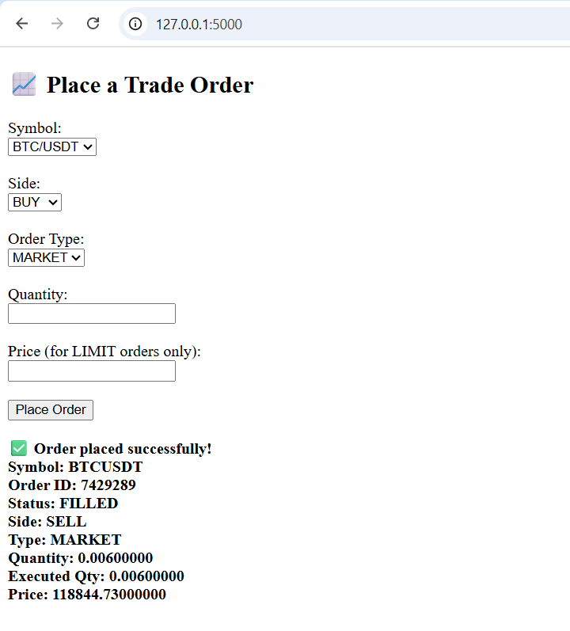

# Crypto-Trading-Bot
A simple Flask-based web application for placing spot market or limit orders on Binance using the official Binance API.

## 🚀 Features

- Trade common cryptocurrency pairs (e.g., BTC/USDT, ETH/USDT)
- Supports both **BUY** and **SELL** orders
- Choose between **MARKET** and **LIMIT** order types
- Web interface built using Flask
- Secure handling of API keys with `.env` file
- Logging of trade events for audit and debugging

## 🛠️ Technologies Used

- Python
- Flask
- Binance API (`python-binance`)
- HTML
- Logging
- dotenv

## 📷 UI Preview

 <!-- Optional: Include a UI screenshot if you have one -->

## 📂 Project Structure

.
├── app.py # Flask application (web interface)
├── bot.py # Trading logic (place order via Binance API)
├── templates/
│ └── index.html # HTML form for submitting trade orders
├── .env # API keys and secrets (excluded in .gitignore)
├── .gitignore # Ignore sensitive and unnecessary files
└── README.md # You're here!

bash
Copy
Edit

## ✅ How to Run

### 1. Clone the repo

```bash
git clone https://github.com/samia122004/crypto-trading-bot.git
cd crypto-trading-bot
